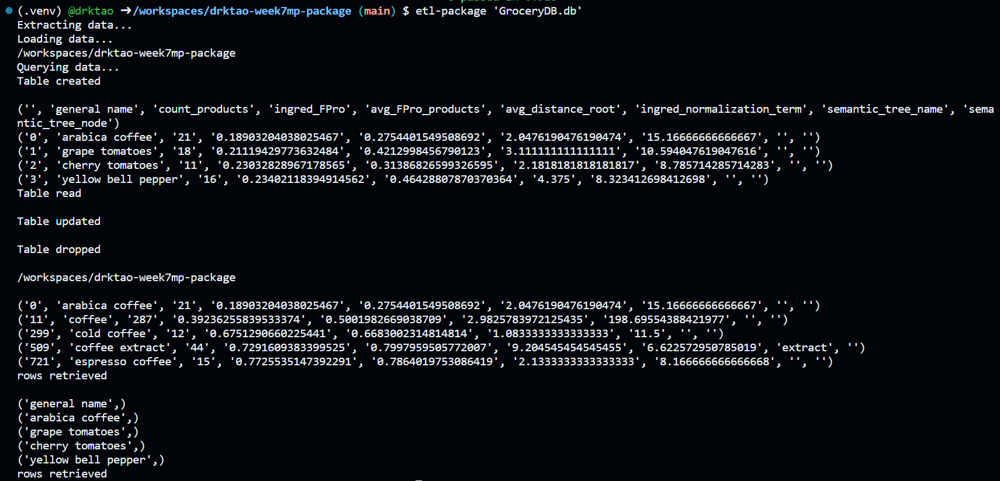

## Package a Python Script into a Command-Line Tool
In this project, I packaged the python scripts from mini project 5, in which I connected to the local `GroceryDB` database and performed CRUD operations, into a command line tool using Click. I have three scripts within the `lib` folder, which perform the following tasks:
1. `extract.py` - extracts a dataset from a URL and creates a file path within the repo
2. `transform_load.py` - transforms and loads the dataset into the local SQLite3 database
3. `query.py` - performs a variety of queries on the database, including:

        `create_db()` - creates a new table with column names if needed
        `read_db()` - displays rows of the data
        `update_db()` - updates certain fields of the data
        `delete_tb()` - deletes a table from the database
        two additional queries that display rows based on certain conditions

As with many prior projects, the repo also contains the following files:
1. `Makefile` - commands for `make install`, `make format`, `make lint`, and `make test`
2. `requirements.txt` - lists necessary packages for this project
3. `main.py` - executes data extraction, loading, and querying
4. `main_test.py` - runs tests on all database queries

Additionally, I have included a user guide for the command line tool in 'user_guide.md'.

Below is a log of successful CRUD database operations, as well as successful tests.

